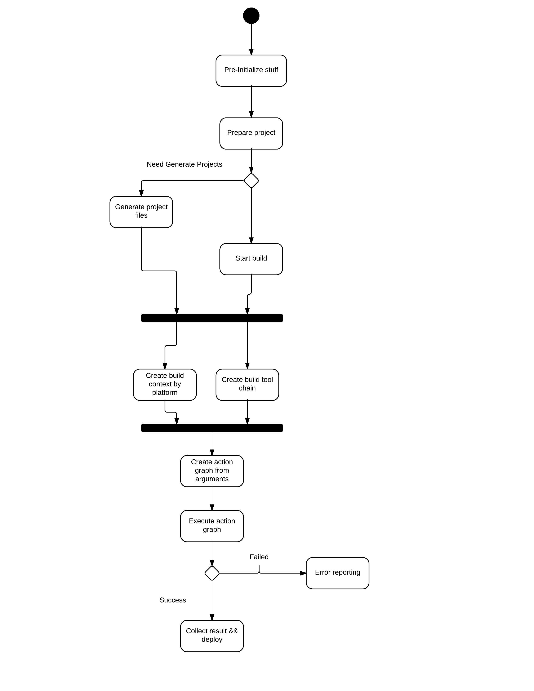

Unreal Build Tool
=================

**Unreal build tool** (*UBT**) manages **Unreal Engine** build process, it helps **Unreal Engine** to build in various platforms, manage module dependences etc.

It's worth to dig into **UBT** in order to improve your productivity.

Core components
---------------

#. UEBuildPlatformFactory

#. UEPlatformProjectGenerator

#. ProjectFile

#. UEBuildPlatformSDK

#. UEBuildDeploy

#. UEBuildPlatform

#. BuildHostPlatform

#. UEBuildPlatformContext

#. ProjectFileGenerator
    
#. MasterProjectFolder

#. UEToolChain

#. UEBuildModule

#. UEBuildTarget

TODO: Artecture overview
   
Work flow
---------

Here is a basic work flow of a basic build process. 

